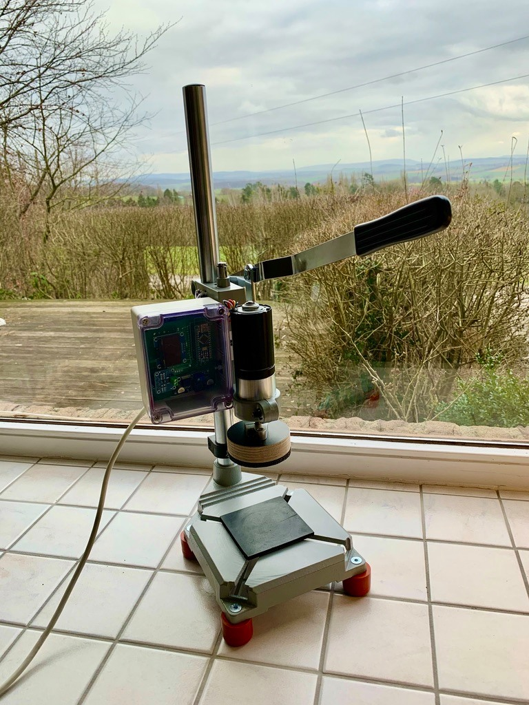
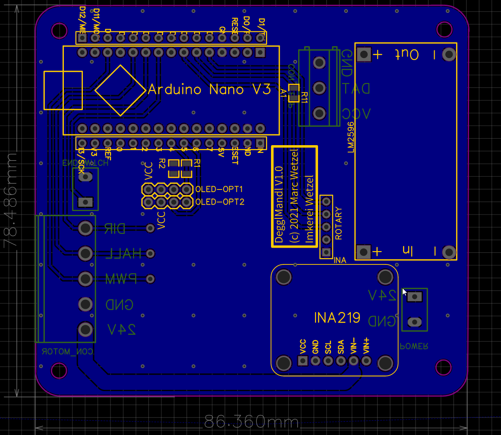
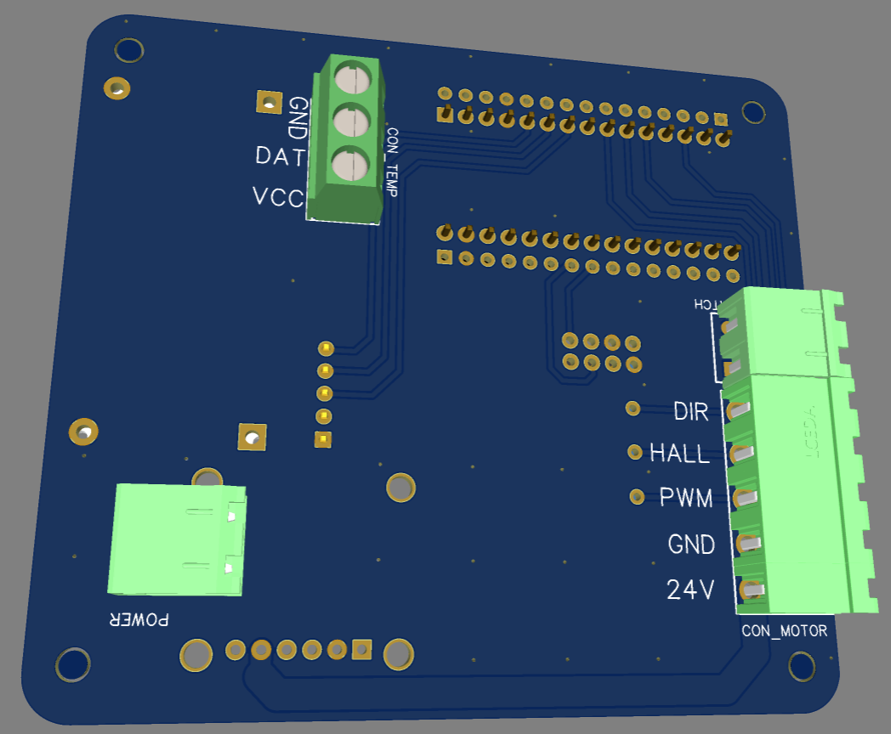

Alles *work in progress* ;-) und momentan 2021/02 gefühlt beta-Status!  

# DegglMandl
DegglMandl ist ein halbautomatischer (Honig-)Glas-Zuschraub-Roboter. 

## Teileliste
### Mechanik
- **Bohrständer** 
  - Wolfcraft Bohrständer, Art-Nr. 3406000, EAN 4006885340602, https://www.wolfcraft.com/products/wolfcraft/de/EUR/Produkte/Vorsatz%C2%ADger%C3%A4te-f%C3%BCr-Maschinen/Bohrst%C3%A4nder/Bohrst%C3%A4nder/p/P_3406  
  - oder: Obi Bohrständer, Art.-Nr. 8035487
https://www.obi.de/bohrstaender/bohrstaender/p/8035487
- ggf. **Gummifüße**, um den Bohrstander rutschfest auf den Tisch zu stellen, Alternative: an Arbeitsplatte festschrauben
  - 4x Gummifüße aka Gummianschlagpuffer mit Innengewinde M6 und 
  - passende M6er Maschinenschrauben, Senkkopf
- **Stehflansch**, z.B. SHF8, Rod Shaft Support, 8 mm, linear,  https://www.ebay.de/itm/1pcs-SHF8-8-mm-linear-Rod-Shaft-Support-Flansch-Mount-linear-Rail-Shaft-Unterst%C3%BC/232389962687
- **Siebdruckplatte**, 18 mm, ca. 90 mm Durchmesser (z.B. mit Lochsäge aussägen)
- **Gummimatte** rund, ca. 90 mm Durchmesser (dickeres Material kann auch gut mit der Lochsäge bearbeitet werden)

### Elektronik
- **Getriebe-Motor, 24 V**, z.B. Chihai CHP-42GP-BL4260, 42 mm, DC 24V, Getriebe 1:92
- **Arduino Nano**, die "alten" / classic **5 V**-Nanos, **nicht** die neuen "Nano 33"-Boards (3,3 V)
- **OLED-Display** mit I2C-Schnittstelle, 0.96" oder 1.3", die Platine untersützt Displays sowohl mit Vcc-GND-SCL-SDA Anschlüssen, und auch Pin-Reihenfolge  GND-Vcc-SCL-SDA 
- **Spannungsregler**, LM2596S-Board
- **Strom-Sensor**, INA219-Board, z.B. https://www.reichelt.de/entwicklerboards-stromsensor-mit-breakoutboard-ina219-debo-sens-power-p266047.html
- **Rotary Encoder** 
-- KY-040, etwas https://www.amazon.de/WayinTop-Encoder-Drehgeber-Drehwinkelgeber-Druckknopf/dp/B07T3672VK/
-- oder diesen etwas kompakteren: https://www.ebay.de/itm/2-5-10PCS-NEW-Rotary-Encoder-Sensor-Development-Module-Brick-Board-Potentiometer/193633079359
- **Endabschalter** 
  - Micro Switch KW12-3 
  - oder größer mit Gehäuse: Nuluxi Endschalter, https://www.amazon.de/gp/product/B07X9381YB
- **Netzteil**, 12 V, ca. 5 A
- **Gehäuse**
  - Kunststoffgehäuse RND 455-00240, 115 x 90 x 55 mm, IP65, z.B. bei Reichelt (ausverkauft?) 
  - oder Electronic Project Box, Plastic, Clear Cover, Waterproof 115 * 90 * 55 mm, https://www.ebay.de/itm/Waterproof-115-90-55MM-Clear-Cover-Plastic-Electronic-Project-Box-Enclosure-s4/283974305486
  
### für Platine

- 2x **steckbare Schraubklemmen, RM 5,08, 2-polig, plus Gegenstück**  
  für (a) Netzteil (Power) und (b) Endabschalter (Endswitch)
- **steckbare Schraubklemme, RM 5,08, 5-polig, plus Gegenstück**, für Motor
- **Stifteleisten, RM 2,54** (liegen bis auf Rotary meist den breakouts bei)
-- 1x 4-polig, für OLED
-- 1x 5-polig, für Rotary
-- 1x 6-polig, für INA219
- **Jumper-Kabel, 5-adrig**, für Rotary
- optional **Buchsenleiste (15 polig oder abzwicken :-)** für weitere Sensoren / debugging
- optional **Schraubklemme, RM 5,08, 3-polig** für con_temp, falls wir mit der Wärmeentwicklung des Motors einmal Probleme haben sollten könnte man hier einen DS18B20 anschließen, oder ihr messt damit ob euer Bier noch kalt / Kaffe noch warm ist, ;-) im code ist (Stand 2021/02) noch nichts dafür vorbereitet
- optional **Widerstand 4,7 kOhm, SMD, Bauform 0805** für Biersensor (s.o.)
- [dnp] 2x Widerstand R1 und R2 (4K7, 0805) werden **nicht benötigt**, da die pullups für den I2C-Bus schon auf der breakout-Platine des INA219 verbaut sind  

**Hinweis:** Alle oben aufgeführten Konnektoren sind Empfehlungen, man kann statt Schraub- auch Federklemmen verwenden oder Kabel direkt anlöten. Bei Abwandlungen allerdings das Rastermaß (RM) beachten, damit alles zusammenpasst! 

## Platine 

